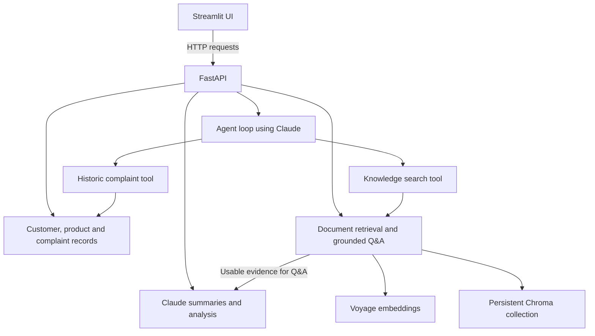

# Banking Complaints Intelligence
## Project Plan

**Domain B — Retail Banking: Complaints and Conduct**  
**Updated:** 29 September 2026  
**Status:** Planned work, not completed functionality.

This plan follows the structure of the supplied Credit Intelligence Platform example, adapted to the personal project brief and the agreed distinction between document search and historic complaint search. Product scope, field names and screen details below are proposed implementation choices. Required features and optional extensions are identified separately.

## 1. Project Overview

Banking Complaints Intelligence is an internal AI assistant for staff who handle complaints at a fictional retail bank.

The system will help staff:

- review complaints and understand the main issue quickly;
- classify complaints by theme and severity;
- find relevant policies, product terms and redress guidance;
- compare a complaint with similar resolved cases;
- recognise recorded customer support needs;
- identify recurring complaint themes for further investigation;
- recommend an appropriate next step with supporting evidence.

This addresses the bank’s high volume of complaints by helping staff review complaints faster, identify recurring patterns and decide how best to handle each complaint.

The system is decision support only. Staff make final decisions about complaint outcomes and compensation. The agent will have read-only tools and cannot close complaints or authorise payments.

A repeated theme is a reason to investigate a possible root cause; the system must not claim that counting similar complaints proves the cause.

## 2. Primary User

**User:** Bank complaints handler.

**Main decision:**

> What happened in this complaint, what guidance applies, and what should I do next?

The platform brings together structured customer, product and complaint records with unstructured policies and case documents.

The proposed initial scope covers mortgages and credit cards, supporting the two example questions in Domain B:

- “How should a late mortgage payment complaint from a vulnerable customer be handled?”
- “What themes are driving current card complaints?”

The first question needs policy evidence and customer context. The second needs counts of complaint records within a defined date range.

## 3. Architecture

The knowledge-search tool uses the retrieval part of the RAG module; it does not generate an answer itself. The dedicated grounded Q&A endpoint adds generation after checking the evidence.

The Streamlit UI calls the API. It does not import backend data or call Claude and Voyage directly.

## 4. Structured Data Model

Use three related entity types. Keep the initial data in `data.py`, following the structure of Firm Intelligence.

### Customer

| Field | Meaning |
|---|---|
| id | Unique customer identifier. |
| name | Fictional customer name. |
| segment | Customer segment, such as standard retail or premium retail. |
| vulnerability_flag | Whether an additional support need has been recorded. |
| support_needs | Optional practical support needs, such as accessible communication. |

The vulnerability flag does not automatically determine severity, entitlement or compensation. The assistant uses recorded information and does not infer vulnerability from a name or demographic stereotype.

### Product

| Field | Meaning |
|---|---|
| id | Unique product identifier. |
| name | Fictional product name. |
| product_type | Mortgage or credit card. |
| terms_document_id | Reference to the applicable synthetic terms document. |

Five product records can be five distinct offerings across the two product types; five different banking sectors are not needed.

### Complaint

| Field | Meaning |
|---|---|
| id | Unique complaint identifier. |
| customer_id | Links to the customer. |
| product_id | Links to the product. |
| description | Customer’s issue and relevant case facts. |
| channel | How the complaint arrived, such as phone, email, branch or online. |
| received_date | Date the complaint was received. |
| theme | Confirmed complaint category; allow unclassified. |
| severity | Confirmed severity; allow unassessed. |
| status | Open, under review or resolved. |
| resolved_date | Date resolved; empty for unresolved complaints. |
| resolution_summary | What staff did and why; empty until resolved. |
| outcome | Recorded result, such as upheld, partially upheld or not upheld. |

Model-generated classification is a proposal. It must not silently overwrite the confirmed record.

## 5. Entity Relationships

| Relationship | Rule |
|---|---|
| Customer → complaints | One customer can have several complaints. Each complaint belongs to one customer. |
| Product → complaints | One product can have several complaints. Each complaint concerns one product. |
| Product → document | Product terms link the product record to prose guidance. |

Example: complaint `CMP-001` belongs to customer `CUS-001` and concerns mortgage product `PRD-001`. The complaint stores those IDs rather than duplicating all customer and product details.

Validate references before creating or updating complaints. Prevent deletion of customers or products still referenced by complaints, returning a clear conflict response.

## 6. Structured Dataset

All records will be synthetic.

Initial target:

| Entity | Target |
|---|---:|
| Customers | 5 or more |
| Products | 5 or more |
| Complaints | Approximately 12, including open and resolved cases |

The brief requires at least five records per entity. Extra complaints will make matching and theme reporting useful.

Include repeated themes, different channels, customers with and without recorded support needs, and both similar and unrelated historic cases.

No real customer data, real account numbers or employer-confidential information will be used. Names and figures will be invented.

Initial structured-record changes will last only while the API process runs. Document this limitation. Persistent storage for these records is an optional extension; persistent Chroma storage is required from the start.

## 7. API Endpoints

### Health and CRUD

| Area | Endpoints |
|---|---|
| Health | `GET /health` |
| Customers | `GET /customers`, `POST /customers`, `GET /customers/{customer_id}`, `PUT /customers/{customer_id}`, `DELETE /customers/{customer_id}` |
| Products | `GET /products`, `POST /products`, `GET /products/{product_id}`, `PUT /products/{product_id}`, `DELETE /products/{product_id}` |
| Complaints | `GET /complaints`, `POST /complaints`, `GET /complaints/{complaint_id}`, `PUT /complaints/{complaint_id}`, `DELETE /complaints/{complaint_id}` |
| Complaint themes | `GET /complaints/themes` |

Register `/complaints/themes` before a dynamic complaint-ID route if necessary to avoid a routing conflict.

### Filters

The brief requires at least two query filters. Planned filters include:

- Customers: `segment`, `vulnerability_flag`.
- Products: `product_type`.
- Complaints: `product_id`, `status`, `severity`, `vulnerability_flag`, `date_from`, `date_to`.

Use Pydantic to validate requests, allowed categories, dates and required values. Return clear errors for unknown records and invalid relationships. Use consistent error bodies across endpoints.

## 8. Deterministic Complaint Matching and Theme Counts

These operations will run in ordinary Python rather than asking Claude to invent matches or calculate counts.

### Historic complaint matching

Input: current complaint ID and a validated result limit.

Process:

1. Look up the current complaint and its product.
2. Select resolved complaints only.
3. Exclude the current complaint.
4. Match product type and confirmed theme.
5. Prefer exact product matches, then use a stable tie-breaker such as resolution date and ID.
6. Return the matching records and reasons for the match.

If the theme is unclassified, request classification/review rather than silently guessing it. If no historic case matches, return an empty result with a clear explanation.

Output includes complaint ID, matched attributes, description, resolution summary, outcome and resolution date. Any ranking value is a rule-based match value, not an embedding score or confidence probability.

### Complaint-theme counts

Input: product type and explicit date range.

Return:

- the requested date range and product filter;
- number of complaints included;
- counts per confirmed theme;
- number of unclassified complaints.

This supports the question about current card complaint themes in the triage screen. Counts describe the synthetic dataset, not the whole bank or wider market.

## 9. Claude Features

| Feature | Endpoint | Behaviour |
|---|---|---|
| Complaint summary | `POST /insights/{complaint_id}/summary` | Summarise the supplied case facts without inventing missing details. |
| Streaming summary | `GET /insights/{complaint_id}/summary/stream` | Forward summary text as Claude generates it. |
| Structured analysis | `POST /insights/{complaint_id}/analyse` | Return a validated complaint classification and recommended next step. |
| Token estimate | `GET /insights/{complaint_id}/summary/estimate` | Estimate input tokens for the summary prompt. |

Keep behavioural rules in the system prompt and case data in the user message. Treat documents and complaint descriptions as data, not instructions to override the system rules.

The estimate endpoint satisfies the brief’s token-estimation alternative. Also return available usage for non-streaming generated responses and always return the agent’s total usage.

Record-only analysis should propose operational next steps, such as checking evidence or seeking specialist review. Policy-specific redress advice requires supporting retrieval and case facts.

## 10. ComplaintAnalysis Schema

Claude output must be validated against a Pydantic model.

| Field | Proposed type or allowed values |
|---|---|
| theme | Enum: late_payment_fee, incorrect_charge, payment_processing_delay, communication_failure, accessibility_issue, other. |
| severity | Enum: low, medium, high. |
| recommended_next_step | Non-empty string describing a concrete next action. |
| rationale | Short explanation grounded in the supplied complaint facts. |
| missing_information | List of case facts that need checking. |
| human_review_required | Boolean; true for this decision-support workflow. |

Theme, severity and recommended next step are required by Domain B. The other fields are project choices to make the recommendation reviewable.

Malformed or invalid model output must result in a controlled error. Do not return unchecked text as if it were a valid analysis.

## 11. Document Corpus

Target ten realistic synthetic documents, exceeding the minimum of eight.

| ID | Document |
|---|---|
| doc-001 | Complaint Handling Policy |
| doc-002 | Vulnerable Customer Support Policy |
| doc-003 | Synthetic Regulatory Guidance: Fair Complaint Handling |
| doc-004 | Mortgage Product Terms |
| doc-005 | Credit Card Product Terms |
| doc-006 | Redress Methodology and Approval Rules |
| doc-007 | Fictional Ombudsman-Style Decision: Mortgage Payment Error |
| doc-008 | Fictional Ombudsman-Style Decision: Incorrect Card Charge |
| doc-009 | Fictional Ombudsman-Style Decision: Communication and Support Failure |
| doc-010 | Complaint Classification and Escalation Procedure |

Write professional policy clauses, terms and case notes. Clearly label synthetic regulatory guidance and fictional ombudsman-style decisions; do not present them as authentic regulatory publications.

Document fields: ID, title, type, body, as-of date and version. Product-specific terms must identify the products they cover.

These documents are separate from historic complaint records. A case decision is a prose reference document; a historic complaint is a structured operational record.

## 12. Embeddings and Vector Search

- Embedding provider: Voyage AI.
- Vector database: persistent Chroma.
- Document text is embedded using `input_type="document"`.
- Search questions are embedded using `input_type="query"`.
- Index using stable document IDs and upsert so repeated indexing does not duplicate documents.
- Store source text and metadata alongside vectors.

Use cosine distance consistently. If returning `1 - distance` as similarity, document that convention. A similarity score is not a probability that an answer is correct.

Start with one vector per short, focused document. Assess document lengths before deciding whether to chunk them and explain the decision in the design note.

## 13. Knowledge Endpoints

| Endpoint | Purpose |
|---|---|
| `POST /knowledge/index` | Embed and upsert the document corpus. Return indexed count and embedding usage when available. |
| `POST /knowledge/search` | Retrieval only. Return document ID, title, text and similarity score for each result. No Claude call. |
| `POST /knowledge/ask` | Retrieve evidence, apply the relevance floor, then answer with citations or refuse. |

Grounded-answer flow:

1. Check whether the collection has been indexed.
2. Embed the question and retrieve documents.
3. Keep results that meet the configured relevance floor.
4. If none qualify, return refusal before calling Claude.
5. Otherwise send the question and usable passages to Claude.
6. Return the answer, source references and usage.

Use a distinct response for an unbuilt index, such as HTTP 409 with a stable error code. A valid request with insufficient evidence is a refusal response, not a missing-record error.

Validate `top_k` as positive and handle requests for more results than the collection contains.

## 14. Relevance Floor

The final relevance floor will be selected from observations, not copied from Firm Intelligence or the example plan.

Compare several experimental values, for example 0.25, 0.35, 0.45 and 0.55, adjusting the range if observed scores warrant it. These are trial values, not approved safety thresholds.

Record:

- whether expected sources were retrieved;
- whether unrelated passages passed the floor;
- whether answerable questions were wrongly refused;
- whether unsupported questions were correctly refused.

Choose the final value based on those trade-offs and the risk of unsupported redress guidance. A high retrieval score alone does not establish that the document answers the question.

## 15. Refusal Rules

### Rule 1 — No sufficiently relevant evidence

For `/knowledge/ask`, when no result clears the relevance floor, do not call Claude. Return an explicit insufficient-evidence refusal and empty sources.

### Rule 2 — Unsupported redress advice

Do not invent compensation amounts, promise a refund or claim entitlement where the supporting policy and case facts are insufficient. Explain what evidence is missing.

A relevant policy may still fail to support an exact amount. Prompts and evaluation must cover this situation as well as below-threshold retrieval.

### Rule 3 — Historic outcomes are not binding

A previous customer’s outcome is a comparison, not permission to promise the same outcome to another customer. Historic lookup cannot substitute for policy evidence.

### Rule 4 — Missing case facts

Ask for or identify missing information rather than guessing it. Do not manufacture an outcome for an unresolved complaint.

### Rule 5 — Human decision authority

The assistant recommends actions only. Its tools cannot update complaint status, close cases or authorise payments. Staff make record changes through separate CRUD operations.

The agent calls Claude initially to choose tools. The zero-Claude-call refusal requirement therefore applies to the dedicated grounded Q&A endpoint. In the agent path, no-evidence tool results must lead to an explicit refusal where policy support is required, rather than unsupported generation.

## 16. Risk-Sensitive and Date-Aware Behaviour

The main risk-sensitive feature is human review, supported by read-only agent tools.

- Highlight recorded vulnerability and practical support needs without assuming an outcome.
- Label generated actions as recommendations for staff review.
- Show source IDs so a handler can check evidence.
- Validate that cited IDs were present in the evidence supplied to Claude; review claim support during evaluation.
- Keep model-proposed classifications separate from confirmed records.

Use complaint receipt dates, resolution dates and document dates. Define “current” with a visible reporting date range. Do not invent regulatory deadlines or import the credit example’s 180-day rule into this project.

## 17. Agent

Endpoint: `POST /agent/ask`.

### Tool 1 — search_knowledge_base

Purpose: search policies, terms, redress guidance and other prose documents.

Input: query string and optional validated result limit.

Output: usable document passages, IDs, titles and scores, or a clear no-evidence result.

### Tool 2 — find_similar_complaints

Purpose: compare a specified complaint with resolved historic complaint records.

Input: complaint ID and optional validated result limit.

Output: matching cases, outcomes, resolution summaries and match reasons. Include the current case context needed to interpret the comparison without exposing unnecessary customer details.

The Python function looks up records and performs matching. Claude decides when to request it and explains returned results.

The current-card-theme question is answered by the record-based triage dashboard initially. To support it through free-text agent chat later, expose the existing theme-count function as a third read-only tool. The agent must not infer population-wide counts from its limited historic-search results.

## 18. Agent Safety and Provider Failures

Configure a hard `MAX_ITERATIONS` limit. Start with a small experimental limit and verify that both tools and a final answer fit. Document the final choice.

- Return unknown tools, missing/invalid arguments and tool failures to Claude as error tool results.
- Append assistant tool requests and corresponding tool results correctly to conversation history.
- Return an explicit incomplete result when the loop limit is reached.
- Count tool execution attempts consistently, including failures.
- Do not assume one tool call equals one iteration; a model turn can request several tools.
- Aggregate usage across every Claude response, including the final answer.

Planned result fields:

`answer`, `completed`, `refused`, `reason`, `tool_calls_made`, `tool_trace`, `input_tokens`, `output_tokens`, `total_tokens`, `stop_reason`.

Refusal is distinct from failure to complete.

### Provider mapping

| Failure | HTTP status |
|---|---:|
| Provider timeout | 504 |
| Provider rate limit | 429 |
| Other upstream provider failure | 502 |

Apply consistent handling to Claude and Voyage. During agent execution, tool-level provider failures become tool errors; top-level provider failures receive the appropriate API response.

For streaming, failures before headers are sent can use HTTP error statuses. A failure after streaming begins needs a defined stream error event and visible UI message because the status can no longer be changed.

## 19. Streamlit UI

The UI is a separate project with its own virtual environment and requirements file.

### Ask the Complaints Agent

Enter a free-text question. Display answer, sources, completion/refusal state, tool-call count, tool trace and token usage. Show a distinct message when the iteration limit is reached.

### Search Knowledge Base

Retrieve without generation. Display every returned result with title, document ID, text and similarity score. Distinguish an unbuilt index from an ordinary provider failure or weak matches.

### Streaming Complaint Summary

Select a complaint and display summary text as it arrives. Show a clear error if the stream fails.

### Complaint Triage — original feature

View complaints with product, theme, severity, status and customer support flag. Filter by product, severity, status, vulnerability and date range. Select a complaint for review and inspect its structured analysis.

Include a small API-backed theme breakdown for the filtered period. All data and counts come from the API; do not duplicate seed data in Streamlit.

## 20. Future Complaint Trends Dashboard

Optional extension after the core triage screen works:

| Product | Theme | Complaint count | Previous-period count | Change |
|---|---|---|---|---|
| Selected product type | Confirmed theme | Calculated | Calculated | Calculated |

This could help staff see which issues are increasing. It requires sufficient dated synthetic records and explicit comparison periods. It must not claim proven root causes from counts alone.

Persistent structured-record storage and a third agent tool for theme counts are also optional extensions, not prerequisites for the required two-tool build.

## 21. Testing Strategy

Mock all Claude and Voyage calls in automated tests. Use isolated test data and a temporary Chroma collection so tests do not alter the demo index. Separately run live checks with the real services.

| Area | Tests/checks |
|---|---|
| API | Health; CRUD for all three entities; filters; invalid input; missing records; broken references; referenced-record deletion. |
| Claude | Summary success and usage; streaming chunks; token estimate; valid/invalid structured analysis; provider status mapping. |
| Retrieval | Upsert avoids duplicates; search returns IDs/titles/scores; empty-index handling; positive top_k validation. |
| Refusal | Below-floor results refuse and mocked Claude call count is zero; unsupported redress cases are covered. |
| Agent | Both tools execute; error tool results for unknown tools/missing arguments/failures; usage totals; clear final answer/refusal. |
| Iteration limit | A model that repeatedly asks for tools terminates with completed=false and the correct stop reason. |
| Historic matching | Only appropriate resolved cases returned; current case excluded; no-match behaviour; stable ranking. |
| Theme counts | Correct product/date filtering and counts, including unclassified records. |
| Live checks | Real indexing and generation; persistence after restart; streaming; all UI screens; both-tool demo and refusal. |

The brief specifically requires summary, refusal and agent-loop tests, including the iteration limit. Other tests above verify concrete risks introduced by this implementation.

## 22. Retrieval Evaluation

A small set of threshold experiments is required to justify the design note. Begin with approximately 10–12 questions covering supported, unsupported and deceptively similar cases.

Each record should include question, expected source IDs, expected answerability/refusal, observed top results and scores, threshold used, and observed outcome.

Keep retrieval failures separate from generation failures. Finding a relevant passage does not prove that the answer used it correctly.

Optional stretch: expand to approximately 25 questions and report top-1/top-3 source retrieval rates, correct-refusal rate and false-refusal rate. Define each metric and its denominator clearly. Do not report unmeasured results.

## 23. Environment Variables

No secrets will be stored in source code or Git.

| Variable | Purpose |
|---|---|
| ANTHROPIC_API_KEY | Claude access. |
| VOYAGE_API_KEY | Voyage access. |
| CLAUDE_MODEL | Selected Claude model. |
| EMBED_MODEL | Selected Voyage embedding model. |
| RELEVANCE_FLOOR | Tested retrieval threshold. |
| MAX_ITERATIONS | Agent loop limit. |
| CHROMA_PATH | Persistent vector-store location. |
| API_BASE_URL | API address used by Streamlit. |

Document actual timeouts/retries and any additional configuration introduced. Provide `.env.example` files with placeholders. Keep `.env` files, environments, caches and generated Chroma storage out of Git.

Select the model during implementation using observed quality, tool support, latency and cost. Record why it was chosen rather than copying the old model choice without review.

## 24. Project Structure and Git Workflow

Work within the existing `project` folder in the course repository. Confirm its exact spelling before terminal setup because earlier screenshots suggested a possible trailing space.

| Location | Contents and purpose |
|---|---|
| `complaints-api/main.py` | FastAPI app, health and router registration. |
| `complaints-api/config.py` | Environment configuration. |
| `complaints-api/data.py` | Customers, products and complaints. |
| `complaints-api/documents.py` | Synthetic prose corpus. |
| `complaints-api/complaint_tools.py` | Historic matching and theme counts. |
| `complaints-api/llm.py` | Claude summary, streaming, analysis and grounded generation. |
| `complaints-api/knowledge.py` | Voyage embedding functions. |
| `complaints-api/knowledge_store.py` | Chroma indexing and search. |
| `complaints-api/agent.py` | Tool definitions, loop and safe execution. |
| `complaints-api/routers/` | `__init__.py`, customers.py, products.py, complaints.py, insights.py, knowledge.py and agent.py. |
| `complaints-api/tests/` | API, LLM, retrieval, refusal, matching and agent tests. |
| `complaints-api/requirements.txt`, `README.md` | Backend dependencies and run instructions. |
| `complaints-ui/app.py` | Streamlit screens. |
| `complaints-ui/api_client.py` | Shared HTTP request handling, if useful. |
| `complaints-ui/requirements.txt`, `README.md` | UI dependencies and run instructions. |
| `docs/specification.md` | Scope, data definitions and acceptance checks. |
| `docs/evaluation.md` | Threshold trials and observed outcomes. |
| `DESIGN-NOTE.md` | Required one-page design note. |
| Root README and this plan | Project introduction and build roadmap. |

Keep Pydantic request models near their routers initially, as in Firm Intelligence; move shared schemas into a common module only when needed.

Do not run another `git init`. Inspect branch and status, stage only intended project paths, review the staged changes, then commit and push each completed stage. Follow any course requirement for project branches. Preserve unrelated course edits.

## 25. Stretch Goals

Begin only after core requirements pass:

1. Expanded retrieval evaluation with reported metrics.
2. Chroma metadata filtering by type/date.
3. Document chunking where justified, retaining source IDs.
4. Optional trends dashboard or third theme-count agent tool.
5. Reranking.
6. Streaming grounded answers as well as summaries.
7. Persistent structured-record storage.
8. Dockerfile and Compose for both projects.
9. Authentication and API rate limiting.

The brief requires persistent Chroma, not a separate relational database. A full 25-question evaluation is optional; actual threshold trials for the design note are still necessary.

## 26. Demonstration and Design Note

### Demo 1 — Both tools in one agent question: required

> For complaint CMP-001, find the relevant handling policy and similar resolved complaints, then recommend a next step with references.

Ensure this ID exists and has a confirmed theme in the synthetic dataset. Show the tool trace proving that knowledge search and historic lookup both ran. Explain which statements come from policies and which are historic comparisons.

Showing the tools only in separate questions does not satisfy this particular hand-in requirement.

### Demo 2 — Correct refusal: required

Ask for a precise compensation amount for a complaint outside the supported product/policy scope. Verify that the question actually lacks supporting evidence in the final corpus.

Also demonstrate or test a related question where retrieval is strong but the requested compensation amount is not supported by the text. The system must not treat similarity as authority.

### Demo 3 — Original UI feature: useful additional demonstration

Filter card complaints by a defined date range and inspect their themes, severity and recorded support needs. Explain that Python calculates the counts from API records.

### One-page design note: required

Answer:

1. Why was this relevance floor chosen, and what happened at other values?
2. Would the documents be chunked? Why or why not, given their length and shape?
3. What is the worst wrong answer the system could give, and what stops it?

Keep detailed trials in `docs/evaluation.md` so the design note remains one page. Be ready to justify model choice and iteration limit as well.

Explain end to end: Voyage receives document/query text; Chroma stores and retrieves vectors, text and metadata; Claude receives instructions, selected case facts, retrieved evidence and tool results depending on the operation.

## 27. Build Process

| Stage | Work | Complete when |
|---|---|---|
| 1. Specification | Agree the proposed scope, record fields, example questions, refusal rules and triage behaviour. | Each required feature has an acceptance check. |
| 2. Setup | Create folders, separate environments, requirements, configuration placeholders and ignore rules. | Files are in the existing repository and secrets are excluded. |
| 3. Data | Write linked records and the document corpus. | Record/document minimums and all Domain B document categories are covered. |
| 4. Basic API | Health, CRUD, filters, validation, relationships and theme counts. | Operations work through /docs and targeted tests pass. |
| 5. Claude | Summary, streaming, estimate, typed analysis and provider errors. | Real generation works and mocked tests cover the contracts. |
| 6. Retrieval | Voyage, persistent Chroma, indexing, search, Q&A and threshold trials. | Index survives restart, sources are returned and below-floor refusal skips Claude. |
| 7. Agent | Historic matching, both tools, loop, usage and safety. | Both-tool question works and endless tool requests terminate clearly. |
| 8. Streamlit | Ask, Search, Streaming summary and Complaint triage. | Every screen calls the real API and handles failures visibly. |
| 9. Delivery | Final checks, READMEs, design note and demo rehearsal. | Another person can run both projects and every required check passes. |

Build one small, explained step at a time. Test and commit as stages become complete.

The brief suggests six days: design/data; API/Claude; retrieval; agent/tests; UI; hardening/demo. These smaller stages follow that sequence. Set actual dates once the deadline and available time are known.

## 28. Definition of Done

### Working features

- [ ] FastAPI runs from its README instructions and has a health endpoint.
- [ ] All three entities have working CRUD, Pydantic validation and useful filters.
- [ ] At least five synthetic records per entity and eight realistic documents are included.
- [ ] Summary, true streaming summary and typed theme/severity/next-step analysis work.
- [ ] Token estimate endpoint works and agent usage is reported in full.
- [ ] System instructions and user data are separated in prompts.
- [ ] Chroma persists and manual Voyage indexing upserts by ID without duplication.
- [ ] Search-only returns every selected result with its score without generation.
- [ ] Grounded answers cite supplied sources.
- [ ] Below-floor Q&A refuses without calling Claude, proved in a test.
- [ ] Unsupported redress advice is refused or deferred for missing evidence.
- [ ] Historic complaint matching works on resolved structured records.
- [ ] Agent handles both tools, tool errors and its iteration limit safely.
- [ ] Agent returns tool counts, total usage and clear completion/refusal status.
- [ ] Provider errors are handled consistently, including streaming failure behaviour.
- [ ] Streamlit has its own environment and all four required features.
- [ ] Unbuilt index, refusal, incomplete agent and ordinary failures are visibly distinct.
- [ ] Triage rows and theme counts come from the API.
- [ ] All normal-operation features use real running services, with no fabricated outputs.

### Six differences from Firm Intelligence

- [ ] Own banking data model, fields and filters.
- [ ] Own non-document-search tool: historic complaint lookup.
- [ ] Own validated complaint-analysis schema.
- [ ] Own strict refusal rule and test evidence.
- [ ] Risk-sensitive control: read-only agent and staff decision authority.
- [ ] Original UI feature: complaint triage and record-based theme breakdown.

### Engineering and submission

- [ ] Automated tests mock LLM and embeddings, covering summary, refusal and agent loop/limit.
- [ ] Live checks separately confirm integration with Claude, Voyage, Chroma and Streamlit.
- [ ] Each project has a complete requirements.txt and exact environment/run instructions.
- [ ] Keys, model names and thresholds are configured through environment variables.
- [ ] No secrets are committed; all records/documents are synthetic.
- [ ] Structured-record restart behaviour is documented honestly.
- [ ] One-page design note answers all three questions using actual observations.
- [ ] One live question demonstrably uses both tools.
- [ ] One live question is correctly refused.
- [ ] Model choice, threshold and iteration limit can be defended.
- [ ] Every button press and provider interaction can be explained out loud.
- [ ] Final project changes are committed and pushed to the existing GitHub repository.

**Immediate next step: Stage 1 — finalise the specification and data fields before writing application code.**
